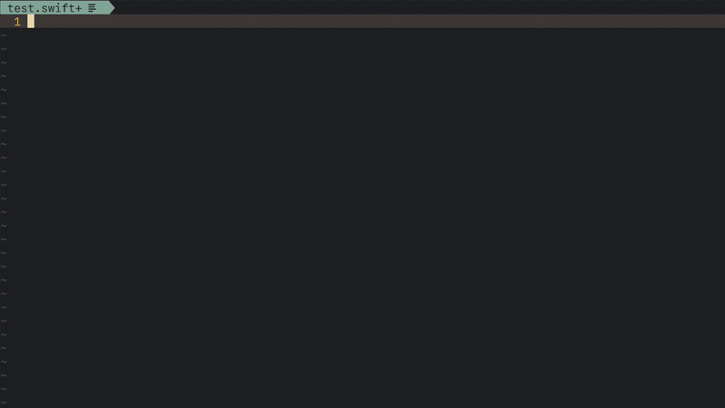

## Introduction

Swift completion for [deoplete](https://github.com/Shougo/deoplete.nvim),
based on [SourceKitten](https://github.com/jpsim/SourceKitten).



## Requirements

- Install and config [SourceKitten](https://github.com/jpsim/SourceKitten#installation)

## vimrc example

```vim

Plug 'dafufer/deoplete_swift'

```

## jump to placeholders

```vim

autocmd FileType swift nmap <buffer> <C-k> <Plug>(deoplete_swift_jump_to_placeholder)
autocmd FileType swift imap <buffer> <C-k> <Plug>(deoplete_swift_jump_to_placeholder)

```

## setting custom target and SDK, and a SPM Module to read flags from it

```vim
" this variables can also be set specifically for a buffer by using b: instead of g:
let g:deoplete_swift_sdk = '/Applications/Xcode.app/Contents/Developer/Platforms/iPhoneOS.platform/Developer/SDKs/iPhoneOS9.0.sdk' "
let g:deoplete_swift_target = 'arm64-apple-ios9.0' 
let g:deoplete_swift_spm_module = 'Module Name' 

```
